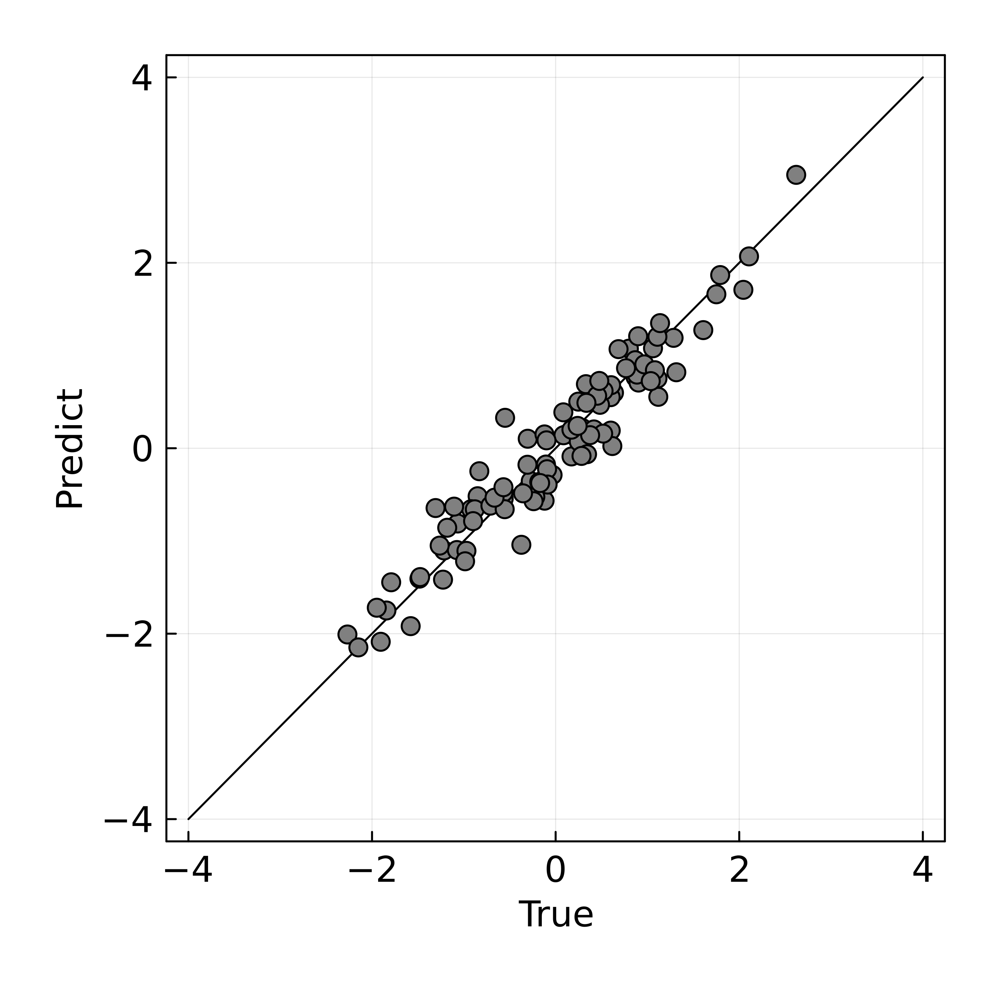
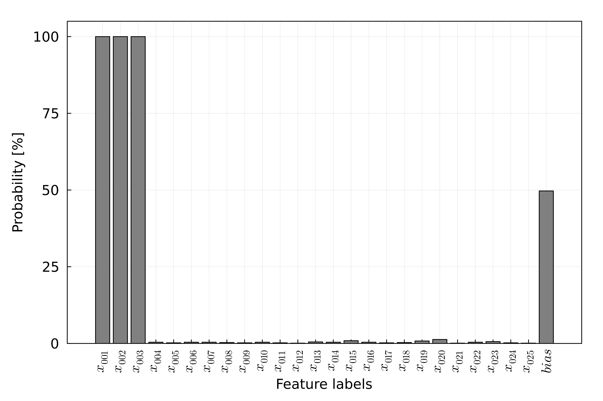
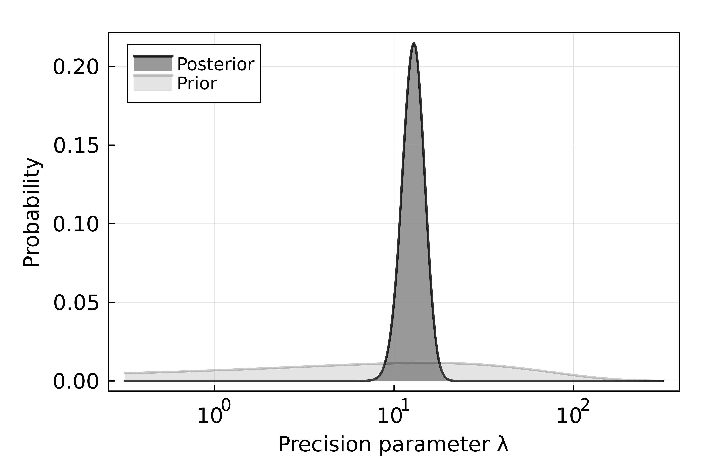
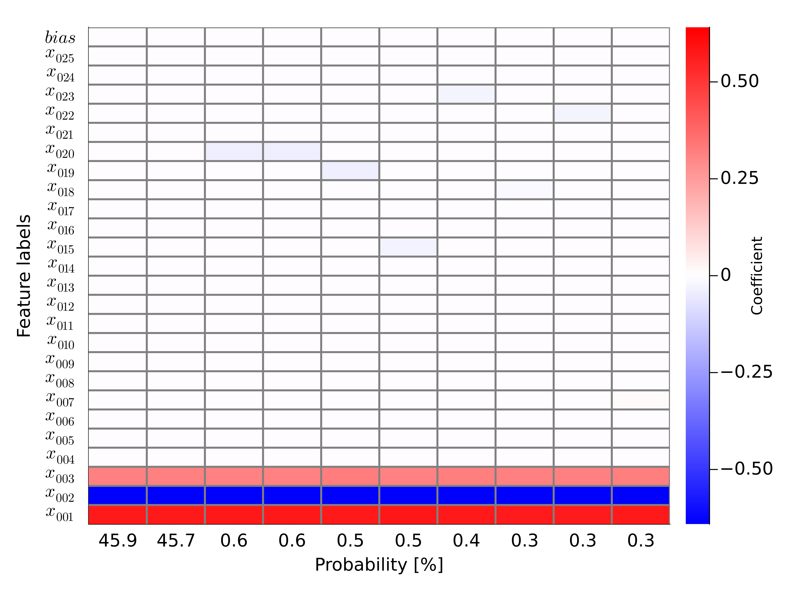

# Bayesian linear regression with feature selection using replica exchange Monte Carlo Method

## Model: Bayesian linear regression with feature selection

Given the data $\mathcal{D}=\\{ (\mathbf{\mathrm{x}}_n, \mathrm{y}_n)|n=1,2,..., N\\}$, we consider a linear regression task. The linear regression model with the feature selection is represented by the input $\mathrm{y}_n \in \mathbb{R}$, the output $\mathbf{\mathrm{x}}_n \in \mathbb{R}^{M}$, the weight coefficients $\mathbf{w} \in \mathbb{R}^{M}$, the subset indicators $\mathbf{g} \in \\{0, 1\\}^{M}$ and the noise $\epsilon_n \in \mathbb{R}$ as follows:

$$
\mathrm{y}_n = (\mathbf{g} \circ \mathbf{w})^{\top}\mathbf{\mathrm{x}}_n + \epsilon_n.
$$

Here, we assume that the noise follows a Gaussian distribution $\mathcal{N}(0, \lambda^{-1})$ as follows:

$$
\epsilon_n \sim \mathcal{N}(0, \lambda^{-1}),
$$

where $\lambda \in \mathbb{R}^{+}$ denote the precision parameter of a Gaussian distribution. Therefore, the probability distribution of $\mathrm{y}_n$ is represented by the above formula as follows:

$$
p(\mathrm{y}_n|\mathbf{g}, \mathbf{w}, \lambda, \mathbf{\mathrm{x}}_n) = \mathcal{N}\left ((\mathbf{g} \circ \mathbf{w})^{\top}\mathbf{\mathrm{x}}_n, \lambda^{-1} \right).
$$

The probability distribution of $\mathcal{D}$ can be expressed as follows:

$$
p(\mathcal{D}|\mathbf{g}, \mathbf{w}, \lambda, \mathbf{\mathrm{x}}_n) = \prod_n{\mathcal{N}\left ((\mathbf{g} \circ \mathbf{w})^{\top}\mathbf{\mathrm{x}}_n, \lambda^{-1} \right)}.
$$

The conditional probability of $\mathbf{g}$ can be expressed using Bayes' theorem and marginalization as follows:

$$
p(\mathbf{g} | \mathcal{D}) \propto p(\mathcal{D}|\mathbf{g}) p(\mathbf{g}) = \int \mathrm{d} \mathbf{w} \mathrm{d} \lambda \ p(\mathcal{D}|\mathbf{g}, \mathbf{w}, \lambda)p(\lambda)p(\mathbf{w})p(\mathbf{g}),
$$

where the probability distribution $p(\mathbf{w})$, $p(\mathbf{g})$, $p(\lambda)$ denote the prior distribution of the stochastic variable. This is, the free energy $F(\mathbf{g})$ given the used indicator $\mathbf{g}$ is expressed as follows: $F(\mathbf{g}) = -\ln{p(\mathbf{g}|\mathcal{D})}$. This code assumed an uninformed distribution as the prior distribution $p(\mathbf{w})$, $p(\mathbf{\lambda})$.

## Model: K-sparse constraints
We introduced K-sparse constraints into the prior distribution of indicator vector $p(\mathbf{g})$. The following shows the prior distribution of the K-sparse constraints:

$$
    p(\mathbf{g}) = I_{\mathrm{K}}(\mathbf{g})\prod_{g_m \in \mathbf{g}}{\mathcal{B}(g_m;p=0.5)},
$$

where the probability distribution $\mathcal{B}(g_m;p=0.5)$ denotes the uninformed Bernoulli distribution. The function $I_{\mathrm{K}}(\mathbf{g})$ denotes the K-sparse indicator function. The function $I_{\mathrm{K}}(\mathbf{g})$ outputs 1 when $\mathbf{g}\cdot\mathbf{g}^{\top} \leq K$ and otherwise 0.

## Algorithm: Replica Exchange Monte Carlo Method
We perform posterior visualization and the maximum a posteriori (MAP) estimation through sampling from the posterior distribution. A popular sampling method is the Monte Carlo (MC) method, which may be bounded by local solutions for cases when the initial value is affected or the cost function landscape is complex.

Therefore, the replica exchange Monte Carlo (REMC) method was used to estimate the global solution. For sampling via the REMC method, a replica was prepared with the inverse temperature $\beta$ introduced as follows:

$$
    p(\mathbf{g}|\mathcal{D};\beta=\beta_{\tau}) = \exp{ (-\beta_{\tau} F(\mathbf{g}) ) } p(\mathbf{g}),
$$

where the inverse temperature $\beta$ is $0 = \beta_1 < \beta_2 < \cdots < \beta_{\tau} < \beta_T = 1$. For each replica, the parameters were sampled using the Monte Carlo method.

## Estimating Density of States using the multi-histogram method
This code can estimate the density of states (DoS) from the histogram $H(F; \beta_{\tau})$ at an inverse temperature $\beta_{\tau}$, which can be obtained by the REMC method. When given the histogram $H(F; \beta_{\tau})$, we can calculate the density of states $D(F)$ by the iteration equation of the normalization constant $Z(\beta_\tau)$ and the density of states:

$$
D(F) = \frac{ \sum_{\tau}{H(F; \beta_{\tau})} }{ \sum_{\tau}{n_\tau \exp({-\beta_{\tau}F})/Z(\beta_\tau)} },
$$

$$
Z(\beta_\tau) = \sum_{F}{D(F)\exp({-\beta_{\tau}F})}
$$

where $n_\tau$ is the number of samples at $\beta_\tau$. We alternately compute the above equations to estimate $D(F)$ and $Z(\beta_\tau)$.

## Example

